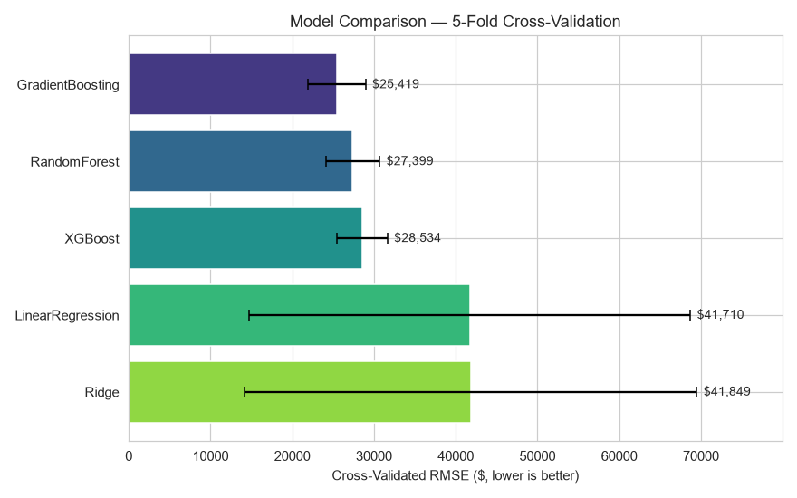
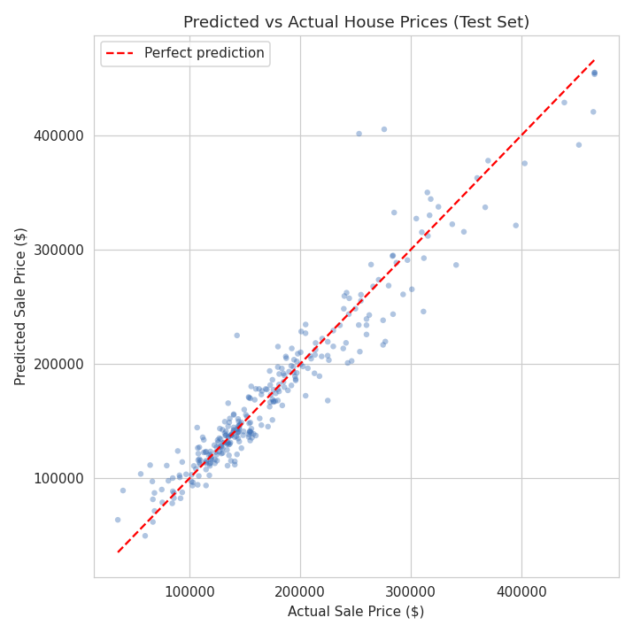
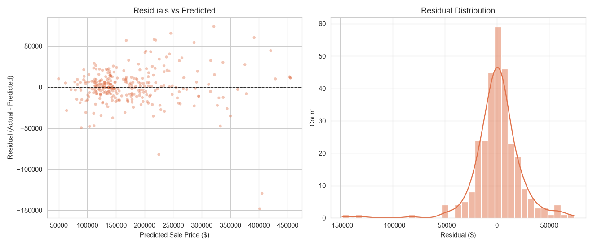
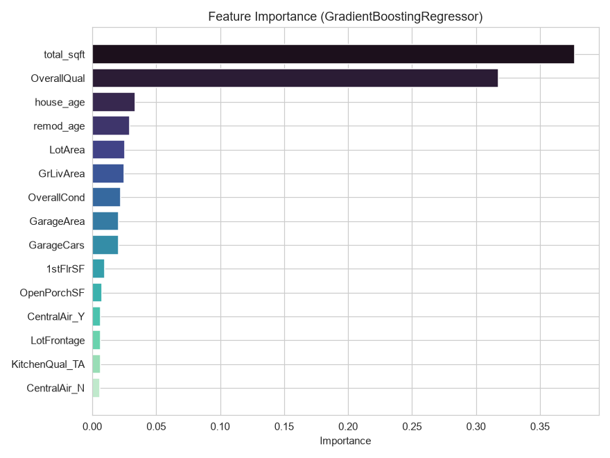
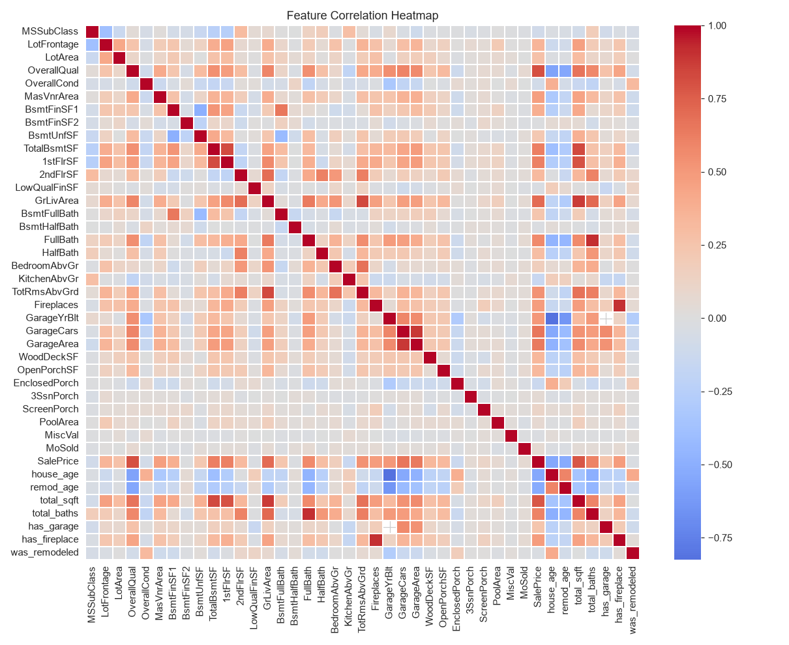

# 🏠 House Price Prediction Platform

An end-to-end machine learning project that predicts residential house
sale prices, built on the real Kaggle **"House Prices - Advanced
Regression Techniques"** dataset (the Ames, Iowa housing data compiled
by Dean De Cock — 1,460 real home sales, 2006-2010). Built to
demonstrate the full ML workflow a junior data scientist / ML engineer
is expected to own: real-world data cleaning, feature engineering,
model selection, hyperparameter tuning, evaluation, and deployment as
an interactive app.

---

## Results at a glance

| Metric (held-out test set) | Value |
|---|---|
| **RMSE** | $22,298 |
| **MAE** | $14,387 |
| **R²** | 0.920 |
| **MAPE** | 9.1% |
| Improvement over naive baseline (predict the mean) | **71.8%** |

The winning model was **Gradient Boosting** (tuned via
`RandomizedSearchCV`), selected after a 5-fold cross-validated
comparison against Linear Regression, Ridge, Random Forest, and
XGBoost:



**Why gradient boosting won, and linear models struggled:** on real
housing data, price depends on messy interactions between features
(a great `OverallQual` matters more in some neighborhoods than others;
basement size matters less once total living area is large) that a
plain linear model can't capture. Linear Regression and Ridge came in
with CV RMSE around $41.7-41.8K and a very high standard deviation
(~$27K) across folds — a sign they were unstable on this data, not just
slightly worse. Tree-based models handle those interactions natively
and landed at $24-28K CV RMSE with far more consistent fold-to-fold
performance.

**A modeling choice worth calling out on purpose:** every model here
is trained on `log(SalePrice)`, not raw dollars, using scikit-learn's
`TransformedTargetRegressor`. This isn't a stylistic flourish — it's
the exact evaluation approach the real Kaggle competition uses,
because `SalePrice` is right-skewed (a handful of expensive homes would
otherwise dominate the loss function and the model would effectively
ignore errors on cheaper, more typical houses).

---

## Diagnostic plots

| Predicted vs Actual | Residuals |
|---|---|
|  |  |

| Feature Importance | Correlation Heatmap |
|---|---|
|  |  |

`OverallQual` (a 1-10 quality/finish score) and `total_sqft` (an
engineered feature combining basement + both floors) dominate the
feature importance chart — consistent with widely-reported findings on
this exact dataset elsewhere.

---

## The real-data lesson this project is built around

Most tutorials use clean, synthetic, or heavily pre-processed data.
This one deliberately doesn't. The Kaggle Ames dataset has a specific
trap that's easy to get wrong:

**Most of its "missing values" are not actually missing.** Kaggle's own
data dictionary states that for columns like `BsmtQual`, `GarageType`,
and `FireplaceQu`, an `NA` means *"this house does not have a
basement / garage / fireplace"* — it's a real category, not a gap to
fill in. Naively running `SimpleImputer(strategy="most_frequent")` on
these columns would silently invent basements for houses that don't
have one.

`data_preprocessing.py` handles this explicitly: `NA_MEANS_NONE_COLUMNS`
gets filled with the literal string `"None"` *before* the imputation
pipeline ever sees it. Only `LotFrontage` (and a single row of
`Electrical`) are genuinely missing in the ordinary sense and get real
median/mode imputation.

```
Columns with missing values (out of 1,460 rows):
PoolQC          1453   <- NA means "no pool", not missing
MiscFeature     1406   <- NA means "no misc feature"
Alley           1369   <- NA means "no alley access"
Fence           1179   <- NA means "no fence"
FireplaceQu      690   <- NA means "no fireplace"
GarageType        81   <- NA means "no garage"
BsmtQual          37   <- NA means "no basement"
LotFrontage      259   <- genuinely missing, gets median-imputed
Electrical         1   <- genuinely missing (1 real data-entry gap)
```

---

## Project structure

```
house-price-prediction/
├── app.py                      # Streamlit interactive demo
├── requirements.txt
├── data/
│   ├── house_data.csv          # Real Kaggle Ames Housing data (1,460 rows)
├── src/
│   ├── data_preprocessing.py   # Real-vs-meaningful-NA handling + sklearn ColumnTransformer
│   ├── feature_engineering.py  # Domain-driven derived features (ages, total sqft, etc.)
│   ├── train_model.py          # CV model comparison + log-target tuning
│   ├── evaluate.py             # Diagnostic plots
│   └── predict.py              # Inference wrapper (HousePricePredictor)
├── tests/
│   └── test_pipeline.py        # Unit tests (pytest) — including NA-handling tests
├── models/
│   ├── house_price_model.pkl   # Trained pipeline (preprocessing + model)
│   └── training_results.json   # Metrics + best hyperparameters
└── visuals/                    # Generated evaluation plots
```

## Why the pipeline is structured this way

- **Preprocessing lives inside a `sklearn.Pipeline`**, not scattered
  pandas edits. The exact same imputation/scaling/encoding logic fit on
  training data runs identically at inference time.
- **The real-vs-meaningful-NA distinction is fixed before the pipeline**,
  not inside it — `SimpleImputer` has no way to know an `NA` is a valid
  category, so that decision has to be made explicitly in `clean_data()`.
- **Multiple model families are cross-validated before tuning anything.**
  The comparison step is what justifies picking Gradient Boosting instead
  of just assuming it would win.
- **The target is log-transformed via `TransformedTargetRegressor`**,
  keeping the transform inside the pipeline object itself so `predict()`
  always returns real dollars — no manual `np.expm1()` calls scattered
  through calling code.
- **A naive baseline (predict the mean) is always reported alongside the
  model**, so the 71.8% improvement number means something concrete.
- **Unit tests explicitly cover the NA-handling logic**, since that's the
  single easiest thing to get subtly wrong on this dataset.

## How to run

```bash
# 1. Install dependencies
pip install -r requirements.txt

# 2. Train + tune the model (compares 5 model families, tunes the winner)
python src/train_model.py

# 3. Generate evaluation plots
python src/evaluate.py

# 4. Run the tests
pytest tests/ -v

# 5. Launch the interactive demo
streamlit run app.py
```

## Using the trained model in your own code

```python
from src.predict import HousePricePredictor

predictor = HousePricePredictor()
price = predictor.predict_one({
    "LotArea": 9600, "LotFrontage": 80, "OverallQual": 6, "OverallCond": 7,
    "TotalBsmtSF": 1000, "1stFlrSF": 1200, "2ndFlrSF": 0, "GrLivArea": 1200,
    "FullBath": 2, "HalfBath": 0, "BedroomAbvGr": 3, "TotRmsAbvGrd": 6,
    "Fireplaces": 1, "GarageCars": 2, "GarageArea": 480,
    "WoodDeckSF": 0, "OpenPorchSF": 40,
    "YearBuilt": 1976, "YearRemodAdd": 1976, "YrSold": 2008,
    "Neighborhood": "NAmes", "HouseStyle": "1Story", "BldgType": "1Fam",
    "CentralAir": "Y", "SaleCondition": "Normal", "ExterQual": "TA",
    "KitchenQual": "TA", "BsmtQual": "TA", "GarageType": "Attchd",
    "FireplaceQu": "TA",
})
print(f"${price:,.0f}")
```

## Engineered features

| Feature | Rationale |
|---|---|
| `house_age` | Age at time of *sale* (`YrSold - YearBuilt`), not today — using today's date would wrongly inflate every house's age in this 2006-2010 dataset |
| `remod_age` | Years since last remodel at time of sale |
| `total_sqft` | `TotalBsmtSF + 1stFlrSF + 2ndFlrSF` — one clean size signal instead of three correlated ones |
| `total_baths` | `FullBath + 0.5 * HalfBath` |
| `has_garage` / `has_fireplace` | Binary presence flags |
| `was_remodeled` | Whether `YearRemodAdd` differs from `YearBuilt` |

The raw `YearBuilt`, `YearRemodAdd`, and `YrSold` columns are dropped
after these are derived, to avoid feeding the model two different ways
of saying the same thing.

## Feature selection note

The real dataset has 79 raw feature columns. This project uses a
curated subset of ~27 (17 numeric + 10 categorical) chosen for a
balance of predictive strength and interpretability, rather than all
79 — a deliberate scope decision for a portfolio project, not a
limitation of the approach. The full column list is documented in
`data_preprocessing.py`.

## Possible extensions

- Expand to the full 79-feature set with more extensive categorical encoding
- Add a SHAP-based explainability report per prediction
- Wrap `predict.py` in a FastAPI service and containerize with Docker
- Try target-encoding for `Neighborhood` instead of one-hot (25 categories)
- Track experiments with MLflow instead of a single `training_results.json`

## Tech stack

Python · pandas · NumPy · scikit-learn · XGBoost · Streamlit · Matplotlib
· Seaborn · pytest

## Data source

Ames Housing dataset, compiled by Dean De Cock for use in data science
education, distributed via the Kaggle "House Prices - Advanced
Regression Techniques" competition.